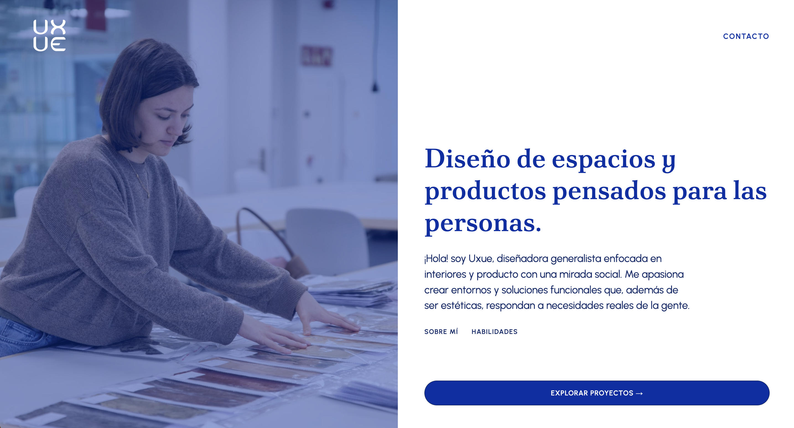

# Portfolio-Uxue-Moyano

Entrega final de la asignatura "Taller de Diseño para Internet"

**Link al portfolio:**
https://github.com/uxuemmarti/portfolio-uxue-moyano

## Vista de mi web

## Tech stack

Este proyecto ha sido desarrollado utilizando las siguientes tecnologías:

- **HTML5:** Estructuración semántica del contenido y optimización SEO (Meta tags y Open Graph).
- **CSS3:** Estilos personalizados, maquetación adaptiva y diseño responsive.
- **Bootstrap 5:** Sistema de rejilla (_Grid_) y componentes estructurales ágiles.
- **JavaScript (ES6):** Renderizado dinámico de la galería de proyectos, sistema de filtrado interactivo en tiempo real y lógica de animaciones nativas al hacer scroll (_Intersection Observer_).

## Uso de IA

Para hacer este proyecto me he ayudado, por un lado, de Gemini: Estructuras de diseño y resolución de problemas o dudas relacionadas con Bootsrap y JavaScript. Por otro lado, he utilizado Copilot de Github para asegurarme de que mi repositorio fuera público y accesible, y de que cumpliera con todos los puntos del briefing.
